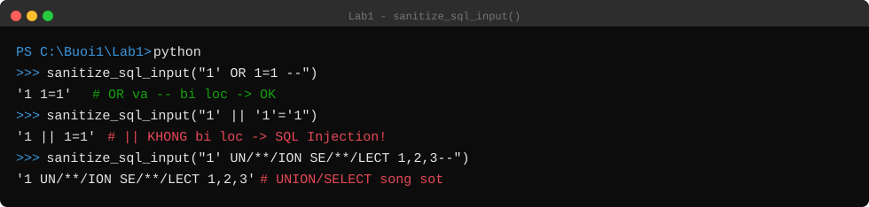

# Lab 1 — SecureValidator: Phân tích điểm yếu bảo mật của `core.py`

> **Mục tiêu:** Không sửa code, mà **chứng minh bằng thực nghiệm** rằng thư viện
> `core.py` — dù đặt tên "Secure" và có docstring khẳng định "ngăn chặn" SSRF / SQL
> Injection / XSS / Path Traversal — vẫn bị **bypass** bằng các biến thể input đơn giản.
> Mỗi mục dưới đây gồm: **Code → Cách bypass → Kết quả chạy thật → Nguyên nhân**.
> Toàn bộ output là kết quả gọi trực tiếp hàm trong `core.py` (Python 3.13), không chỉnh sửa.



## Cấu trúc

```
Lab1/
├── core.py             <-- đối tượng phân tích
├── app.py  index.html  test_validators.py
├── requirements.txt  render.yaml  .gitignore
```

`python -m unittest test_validators` → **Ran 10 tests ... OK**. Điểm mấu chốt:
**test xanh không có nghĩa là an toàn** — bộ test chỉ chạy đúng vài case mẫu.

---

## 1. Bypass `validate_url()` → SSRF (Server-Side Request Forgery)

### Code
```python
def validate_url(url: str) -> bool:
    """Validate URL and prevent basic SSRF vectors."""
    parsed = urllib.parse.urlparse(url)
    return parsed.scheme in ['http', 'https'] and bool(parsed.netloc)
```

### Bypass
Hàm chỉ kiểm tra `scheme` + có `netloc` — **không kiểm tra host trỏ vào đâu**. Mọi địa
chỉ nội bộ / loopback / metadata cloud đều được chấm hợp lệ.

### Kết quả chạy thật
```
>>> validate_url("http://127.0.0.1:6379/")                    -> True   # Redis nội bộ
>>> validate_url("http://169.254.169.254/latest/meta-data/")  -> True   # metadata cloud (lộ credential)
>>> validate_url("http://2130706433/")                        -> True   # = 127.0.0.1 dạng số nguyên
>>> validate_url("https://google.com")                        -> True
```

### Nguyên nhân
Docstring hứa "prevent SSRF" nhưng **không có allowlist domain, không resolve DNS để
loại IP private/loopback/link-local**. Nếu server dùng URL này để tự fetch (webhook,
preview link), kẻ tấn công ép server gọi vào dịch vụ nội bộ hoặc endpoint metadata
`169.254.169.254` để lấy credential tạm thời. → **CWE-918**. Cách đúng: allowlist +
resolve DNS + chặn dải private, chặn redirect về nội bộ.

---

## 2. Bypass `sanitize_sql_input()` → SQL Injection

### Code
```python
def sanitize_sql_input(input_str: str) -> str:
    sanitized = re.sub(r"(--|;|'|\"|#)", "", input_str)
    sanitized = re.sub(r"\b(OR|AND|SELECT|INSERT|DELETE|UPDATE|DROP|UNION|WHERE)\b",
                        "", sanitized, flags=re.IGNORECASE)
    return sanitized.strip()
```
Đây là **blacklist**: xoá vài ký tự (`-- ; ' " #`) và vài từ khoá. Blacklist không bao
giờ đầy đủ.

### Bypass
```python
# || là toán tử OR trong MySQL/SQLite — KHÔNG có trong blacklist
payload  = "1' || '1'='1"

# Tách từ khoá bằng comment /**/ để không khớp \bUNION\b, \bSELECT\b
payload2 = "1' UN/**/ION SE/**/LECT 1,2,3--"
```

### Kết quả chạy thật
```
>>> sanitize_sql_input("1' OR 1=1 --")
'1  1=1'                              # OR và -- bị lọc (trường hợp mẫu — có vẻ OK)

>>> sanitize_sql_input("1' || '1'='1")
'1 || 1=1'                           # || KHÔNG bị lọc → mệnh đề luôn đúng vẫn còn nguyên

>>> sanitize_sql_input("1' UN/**/ION SE/**/LECT 1,2,3--")
'1 UN/**/ION SE/**/LECT 1,2,3'       # UNION/SELECT sống sót vì bị /**/ tách đôi

>>> sanitize_sql_input("1 XOR 1=1")
'1 XOR 1=1'                          # XOR cũng không có trong blacklist
```

### Nguyên nhân
`\bOR\b` chỉ khớp "OR" đứng riêng, nên `||`, `XOR`, `LIKE`, `BETWEEN`, `CASE WHEN`...
đều lọt. Comment `/*...*/` không bị xoá nên `UN/**/ION` không khớp `\bUNION\b` nhưng
engine SQL (MySQL) vẫn hiểu là `UNION`. → **CWE-89**. Blacklist **không bao giờ hoàn
chỉnh**. Cách đúng: **parameterized query / prepared statement**
(`cursor.execute("... WHERE id = %s", (val,))`), không phải lọc chuỗi.

---

## 3. Bypass `validate_filename()` → Path Traversal

### Code
```python
def validate_filename(filename: str) -> bool:
    if ".." in filename or "/" in filename or "\\" in filename:
        return False
    return os.path.basename(filename) == filename
```

### Bypass
```python
# Null byte — không nằm trong danh sách ký tự bị chặn
payload = "file.txt\x00.jpg"
```

### Kết quả chạy thật
```
>>> validate_filename("report.pdf")           -> True    (đúng)
>>> validate_filename("../../etc/passwd")     -> False   (đúng — chặn được ../ )
>>> validate_filename("file.txt\x00.jpg")     -> True    <-- LỌT: null byte vẫn "hợp lệ"
```

### Nguyên nhân
Đây là hàm chắc nhất file (chặn `..`, `/`, `\` tốt), nhưng: (1) null byte `\x00` vẫn cho
qua — hàm "nói dối" rằng input an toàn; (2) hàm giả định input **chưa** bị URL-decode —
nếu tầng trên decode `..%2f..%2f` thành `../../` **sau** bước này thì traversal xảy ra ở
bước khác. → **CWE-22**. Cách đúng: kiểm tra sau khi đã decode hết + so
`os.path.realpath()` với thư mục gốc cho phép.

---

## 4. `validate_email()` → Kiểm tra hình thức quá lỏng

### Code
```python
pattern = r'^[\w\.-]+@[\w\.-]+\.\w+$'
return re.fullmatch(pattern, email) is not None
```

### Kết quả chạy thật
```
>>> validate_email("a"*300 + "@b.com")        -> True   # 306 ký tự — không giới hạn độ dài
>>> validate_email("user@xn--80ak6aa92e.com") -> True   # domain punycode/homograph
>>> validate_email("plainaddress")            -> False  # (đúng)
```

### Nguyên nhân
Không giới hạn độ dài; `\w` khớp cả Unicode nên domain giả dạng (homograph) vẫn "hợp lệ
về hình thức" → nguy cơ phishing nếu hiển thị lại. Mức độ **thấp** (CWE-20) — validate
hình thức email không phải là một control bảo mật.

---

## 5. `sanitize_html_input()` → Đúng cho text node, chưa đủ cho ngữ cảnh khác

### Code
```python
def sanitize_html_input(html_str: str) -> str:
    return html.escape(html_str)
```

### Kết quả chạy thật
```
>>> sanitize_html_input('<script>alert(1)</script>')
'&lt;script&gt;alert(1)&lt;/script&gt;'            # OK cho text node

>>> sanitize_html_input('')
'&lt;img src=x onerror=alert(1)&gt;'              # OK cho text node
```

### Nguyên nhân
`html.escape()` là cách đúng **khi giá trị đặt giữa hai thẻ HTML**. Nhưng nếu chèn vào
thuộc tính không có ngoặc kép, vào `href="javascript:..."`, hay bên trong `<script>`
thì escape HTML **không đủ** — cần escape theo ngữ cảnh JS/URL. Đây là ví dụ về
**context-aware escaping**: không có một hàm "escape chung" cho mọi ngữ cảnh.

---

## 6. Bảng tổng hợp

| Hàm | Có vẻ chống được | Bypass thực tế | Mức độ | CWE |
|---|---|---|---|---|
| `validate_url` | SSRF | `127.0.0.1`, `169.254.169.254`, IP số nguyên đều pass | **Cao** | CWE-918 |
| `sanitize_sql_input` | SQL Injection | `\|\|`, `XOR`, `UN/**/ION` bypass blacklist | **Nghiêm trọng** | CWE-89 |
| `validate_filename` | Path Traversal | null byte `\x00` cho qua; decode sau khi check | Trung bình | CWE-22 |
| `validate_email` | Email sai định dạng | không giới hạn độ dài; homograph | Thấp | CWE-20 |
| `sanitize_html_input` | XSS | đúng text node; thiếu ngữ cảnh attribute/JS/URL | Thấp–TB | CWE-79 |

## 7. Bài học chính

1. **Test xanh ≠ an toàn** — bộ test chỉ chạy đúng case mà hàm được viết để chặn.
2. **Blacklist không bao giờ hoàn chỉnh** — luôn có ký tự/từ khoá/biến thể chưa nghĩ tới
   (`||`, `XOR`, `/**/`, null byte...). Với SQL, giải pháp đúng là **parameterized
   query**, không phải "lọc chuỗi sạch hơn".
3. **Validate và escape phụ thuộc ngữ cảnh** — `validate_url` sai vì chỉ xét hình thức
   URL chứ không xét đích mạng; `sanitize_html_input` chỉ đúng cho một ngữ cảnh.
4. **Hàm tên `secure_*` không tự động an toàn** — luôn kiểm chứng bằng input độc hại thật.

---

*Ghi chú: `core.py`, `requirements.txt`, `.gitignore`, `index.html` chép nguyên văn từ
tài liệu. `app.py` không có trong tài liệu (chỉ thấy log chạy) nên được viết lại tối
giản. Cấu trúc gốc là package `securevalidator/` + `templates/`, ở đây gộp phẳng vào
`Lab1/`. Toàn bộ output PoC là kết quả chạy thật trên `core.py` không sửa đổi.*
