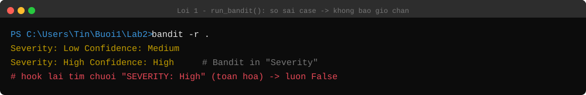
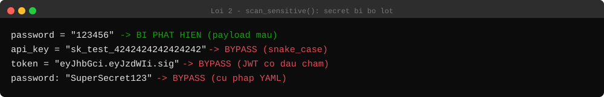
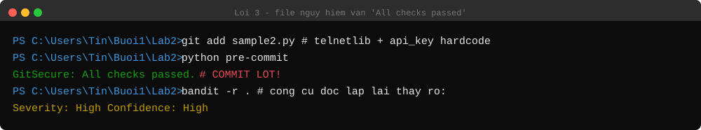
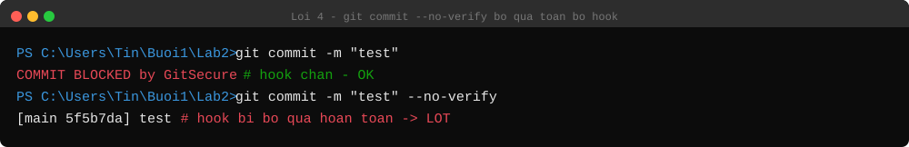
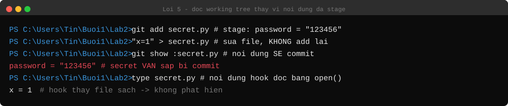
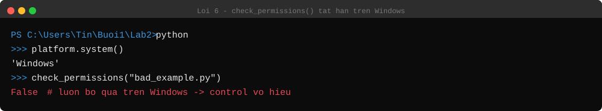

# Lab 2 — GitSecure: Phân tích điểm yếu của pre-commit hook

> **Mục tiêu:** Không sửa code, mà **chứng minh** rằng pre-commit hook "GitSecure" —
> được quảng cáo "tự động ngăn chặn rủi ro bảo mật trước khi commit" — có nhiều điểm mù
> khiến nó **cho commit lọt** dù có secret hardcode và lỗ hổng thật.
> Mỗi mục: **Code → Cách bypass → Kết quả chạy thật → Nguyên nhân**. Output là kết quả
> chạy thật `pre-commit` (không sửa) cùng Bandit 1.9.4.

## Cấu trúc

```
Lab2/
├── pre-commit          <-- đối tượng phân tích (đặt tại .githooks/pre-commit khi cài thật)
├── bad_example.py      (password = "123456" — file test)
├── requirements.txt  .gitignore
```

---

## 1. Bypass `run_bandit()` → Kiểm tra Bandit KHÔNG BAO GIỜ chạy



### Code
```python
result = subprocess.run(["bandit", "-r", "."], capture_output=True, text=True)
if "SEVERITY: High" in result.stdout:      # <-- so khớp chuỗi TOÀN HOA
    return "Bandit: High severity issues found."
```

### Bypass
Không cần bypass — lỗi nằm sẵn trong code: Bandit **không bao giờ** in `"SEVERITY: High"`
(toàn hoa). Bandit thật in `"Severity: High"` (chỉ chữ S hoa).

### Kết quả chạy thật
```
$ bandit -r .                     # file có import telnetlib (lỗi High/High thật)
   Severity: Low    Confidence: Medium
   Severity: High   Confidence: High     <-- Bandit in "Severity", KHÔNG phải "SEVERITY"
   Severity: High   Confidence: High
```
→ Điều kiện `"SEVERITY: High" in result.stdout` **luôn là False**.

### Nguyên nhân
Sai case-sensitive (`SEVERITY` vs `Severity`). Đây là **silent failure**: không có
exception, không cảnh báo, hook vẫn in `GitSecure: All checks passed.` — cả lớp "quét lỗ
hổng bằng Bandit" coi như không tồn tại. Cách đúng: dùng `bandit -f json` rồi parse output
có cấu trúc, không grep chuỗi tiếng người.

---

## 2. Bypass `scan_sensitive()` → Secret hardcode vẫn lọt



### Code
```python
SENSITIVE_PATTERNS = [
    r"apikey\s*=\s*['\"][A-Za-z0-9_\-]{16,}['\"]",
    r"secret\s*=\s*['\"][A-Za-z0-9_\-]{8,}['\"]",
    r"token\s*=\s*['\"][A-Za-z0-9]{10,}['\"]",
    ...
]
```

### Bypass
```python
api_key = "sk_test_4242424242424242"      # snake_case: 'api_key' KHÁC 'apikey'
SECRET_KEY_2 = "django-insecure-x93hf82"  # có hậu tố → \s* không khớp dấu "_"
token = "eyJhbGci.eyJzdWIi.sig"           # JWT có dấu chấm → [A-Za-z0-9] không khớp
```

### Kết quả chạy thật
```
BỊ PHÁT HIỆN              | password = "123456"                  (payload mẫu trong sách)
BYPASS - KHÔNG PHÁT HIỆN  | api_key = "sk_test_4242424242424242" (snake_case)
BYPASS - KHÔNG PHÁT HIỆN  | SECRET_KEY_2 = "django-insecure-..."
BYPASS - KHÔNG PHÁT HIỆN  | token = "eyJhbGci.eyJzdWIi.sig"      (JWT có dấu chấm)
BYPASS - KHÔNG PHÁT HIỆN  | password: "SuperSecret123"           (cú pháp YAML, dùng :)
```

### Nguyên nhân
Pattern yêu cầu từ khoá đứng sát trước `=` + giá trị trong ngoặc kép. `\s*` không khớp
dấu `_`, nên `api_key`/`SECRET_KEY_2` lọt; JWT có `.` không nằm trong `[A-Za-z0-9]`. →
blacklist theo mẫu cố định, cùng lỗi tư duy với `sanitize_sql_input` ở Lab1.

---

## 3. Kết hợp 1+2 → File nguy hiểm vẫn "All checks passed"



### Kết quả chạy thật
```python
# sample2.py — vừa lộ API key (snake_case), vừa có lỗi High/High thật (telnetlib)
import telnetlib
api_key = "sk_live_51H8xJ2eZvKYlo2C0"
t = telnetlib.Telnet("internal-server.local")
```
```
$ git add sample2.py
$ python pre-commit
GitSecure: All checks passed.        <-- COMMIT LỌT
$ echo $?
0

$ bandit -r .                        # nhưng Bandit độc lập thấy rõ:
   Severity: High   Confidence: High
   Severity: High   Confidence: High
```

### Nguyên nhân
Lỗi 1 (bandit chết) + lỗi 2 (regex né được) cộng dồn → hook mù hoàn toàn với file này.

---

## 4. Bypass toàn bộ hook → `git commit --no-verify`



### Nguyên nhân (giới hạn kiến trúc)
- `git commit --no-verify` bỏ qua **toàn bộ** pre-commit — chỉ cần thêm 1 flag.
- Hook chỉ chạy nếu người dùng tự `git config core.hooksPath .githooks` sau khi clone;
  ai quên bước này thì hook **im lặng không chạy**.
- `.githooks/pre-commit` nằm trong repo, ai cũng sửa/xoá điều kiện chặn được.

→ pre-commit hook là **tiện ích cho dev**, không phải **security control**. Kiểm soát thật
phải ở **server-side** (pre-receive hook / CI pipeline / secret scanning của GitHub).

---

## 5. `scan_sensitive()` đọc working tree, không đọc nội dung staged



### Kết quả chạy thật
```
$ echo 'password = "123456"' > secret.py
$ git add secret.py                                  # secret vào INDEX
$ echo 'x = 1  # da xoa' > secret.py                 # sửa file, KHÔNG add lại

$ git show :secret.py        # nội dung SẼ được commit
password = "123456"
$ cat secret.py              # nội dung hook đọc bằng open()
x = 1  # da xoa
```

### Nguyên nhân
Hook dùng `open(file_path)` → đọc file trên đĩa, không phải nội dung đã stage. Secret vẫn
trong index và sắp được commit nhưng hook không thấy. Cách đúng: `git show :<file>`.

---

## 6. `check_permissions()` trên Windows → tắt hẳn kiểm tra



### Code
```python
def check_permissions(file_path):
    if platform.system() == "Windows":
        return False                # <-- luôn bỏ qua trên Windows
    ...
```

### Nguyên nhân
Bản gốc chấm mọi file trên Windows là world-writable (do Windows không dùng bit POSIX
`S_IWOTH`). Bản "vá" không sửa cho đúng mà **tắt hẳn** kiểm tra trên Windows → control này
vĩnh viễn không chạy trên nền tảng nhiều sinh viên dùng (chuyển false positive thành false
negative).

---

## 7. Bảng tổng hợp

| Thành phần | Quảng cáo | Thực tế (đã kiểm chứng) | Mức độ |
|---|---|---|---|
| `run_bandit()` | Chặn khi Bandit thấy lỗi High | So sai case → **không bao giờ chặn** | **Nghiêm trọng** |
| `scan_sensitive()` | Bắt secret hardcode | Lọt snake_case, JWT, YAML, giá trị không quote | **Cao** |
| Nguồn đọc file | Quét nội dung sắp commit | Đọc working tree, không đọc index | Trung bình |
| Kiến trúc hook | "Tự động ngăn chặn" | Opt-in client, `--no-verify` là xong | **Cao** |
| `check_permissions` Windows | Cảnh báo world-writable | Luôn `return False` | Trung bình |

## 8. Bài học chính

1. **Một typo case-sensitive (`SEVERITY` vs `Severity`) vô hiệu hoá cả một lớp bảo vệ**
   mà không có dấu hiệu gì → luôn test bằng case dương tính (input *phải* bị chặn).
2. **Regex/blacklist theo mẫu cố định luôn có khoảng trống** (Lab1 lặp lại ở Lab2).
3. **Pre-commit hook không phải security boundary** — dễ tắt, dễ quên; kiểm soát thật
   phải ở server (CI/CD, pre-receive, secret scanning).
4. **"Vá" bằng cách tắt tính năng không phải là sửa lỗi.**

---

*Ghi chú: `pre-commit` chép nguyên văn từ tài liệu (gồm bản vá `check_permissions` cho
Windows). Cài thật cần đặt tại `.githooks/pre-commit` + `git config core.hooksPath
.githooks` + `chmod +x`; ở đây đặt phẳng trong `Lab2/` để nhất quán với Lab1/Lab3.
`bad_example.py` tương ứng `pre-commit-hook-test/bad.py`. Output PoC là kết quả chạy thật
cùng Bandit 1.9.4.*
