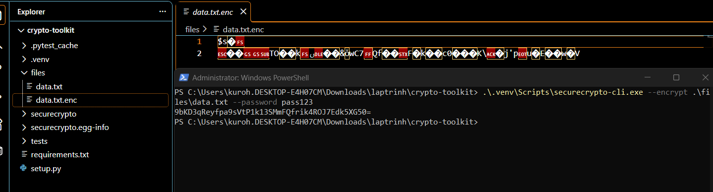
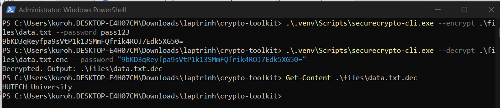
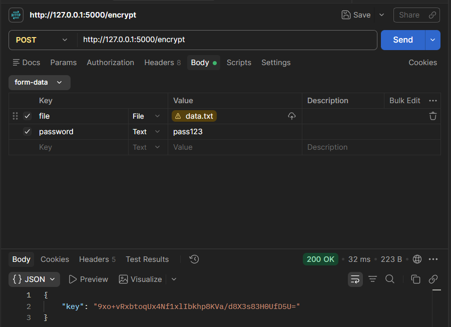
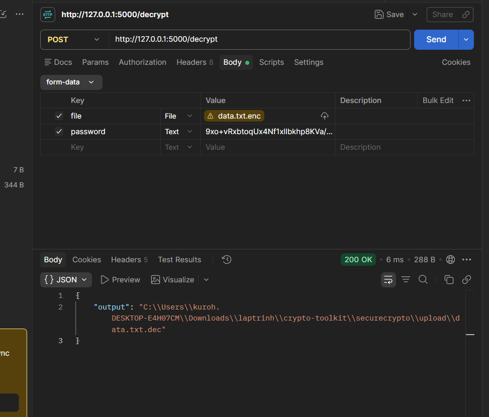
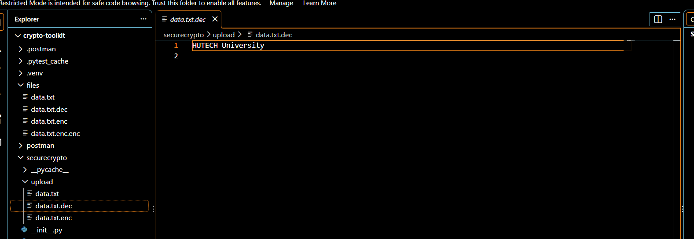

# Lab 1 — SecureCrypto Toolkit

> **Mục tiêu:** xây dựng một bộ công cụ mật mã nhỏ bằng Python, gồm mã hóa file
> với AES-GCM, ký/xác thực chữ ký RSA, băm mật khẩu bằng Argon2 và ba cách sử
> dụng: dòng lệnh, giao diện Tkinter và Flask API.

## 1. Cấu trúc

```text
Lab1/
├── files/
│   └── data.txt
├── images/
├── securecrypto/
│   ├── __init__.py
│   ├── aes_utils.py
│   ├── api.py
│   ├── app_gui.py
│   ├── cli.py
│   ├── hash_utils.py
│   └── rsa_utils.py
├── tests/
│   ├── test_aes_utils.py
│   ├── test_hash_utils.py
│   └── test_rsa_utils.py
├── requirements.txt
└── setup.py
```

## 2. Cài đặt

Chạy lần lượt trong PowerShell:

```powershell
cd "Buoi 2\Lab1"
python -m venv .venv
.\.venv\Scripts\python.exe -m pip install -e .
.\.venv\Scripts\python.exe -m pip install -r requirements.txt
```

`pip install -e .` cài package `securecrypto` ở chế độ editable và tạo lệnh
`securecrypto-cli`. Các thư viện chính:

- `cryptography`: PBKDF2, AES-GCM và RSA;
- `argon2-cffi`: băm mật khẩu;
- `flask`: cung cấp API HTTP;
- `pytest`: chạy unit test.

## 3. Luồng mã hóa AES-GCM

Hàm `encrypt_file_aes()` hoạt động theo thứ tự:

1. Sinh `salt` ngẫu nhiên 16 byte.
2. Dùng PBKDF2-HMAC-SHA256 với 100.000 vòng để dẫn xuất khóa AES 32 byte từ
   mật khẩu.
3. Sinh `nonce` ngẫu nhiên 12 byte.
4. Mã hóa toàn bộ file bằng AES-GCM. GCM vừa bảo mật nội dung vừa kiểm tra tính
   toàn vẹn bằng authentication tag.
5. Ghi file đầu ra theo cấu trúc `[salt 16 byte][nonce 12 byte][ciphertext + tag]`.
6. Trả khóa AES ở dạng Base64 để dùng khi giải mã.

Khi giải mã, chương trình tách `salt`, `nonce`, ciphertext/tag; giải mã bằng khóa
Base64 được cung cấp và tạo file có đuôi `.dec`.

> Đây là bài thực hành. Cần bảo vệ khóa Base64 như một bí mật; không công khai
> khóa thật hoặc dùng Flask development server trong môi trường production.

## 4. Chạy bằng CLI

### Mã hóa

```powershell
.\.venv\Scripts\securecrypto-cli.exe --encrypt .\files\data.txt --password pass123
```

Lệnh tạo `files/data.txt.enc` và in khóa Base64:



### Giải mã

Sao chép chính xác khóa nhận được ở bước trên:

```powershell
.\.venv\Scripts\securecrypto-cli.exe --decrypt .\files\data.txt.enc --password "KEY_BASE64"
Get-Content .\files\data.txt.dec
```

Nếu thành công, file giải mã chứa lại nội dung `HUTECH University`:



## 5. Chạy giao diện Tkinter

```powershell
.\.venv\Scripts\python.exe -m securecrypto.app_gui
```

- Nhập mật khẩu rồi bấm **Encrypt**, chọn file gốc và lưu lại khóa được hiển thị.
- Để giải mã, thay nội dung ô nhập bằng khóa Base64, bấm **Decrypt** và chọn file
  `.enc` tương ứng.

## 6. Chạy Flask API

```powershell
.\.venv\Scripts\python.exe -m securecrypto.api
```

Server chạy tại `http://127.0.0.1:5000`.

### `POST /encrypt`

Gửi `multipart/form-data`:

| Key | Kiểu | Giá trị |
|---|---|---|
| `file` | File | file cần mã hóa |
| `password` | Text | mật khẩu dẫn xuất khóa |

Phản hồi thành công trả về khóa Base64:

```json
{"key": "..."}
```



### `POST /decrypt`

Gửi file `.enc` trong trường `file`; trường `password` nhận **khóa Base64** vừa
trả về từ `/encrypt`.

```json
{"output": ".../data.txt.dec"}
```



Nội dung sau giải mã khớp file ban đầu:



## 7. RSA và Argon2

### RSA

`rsa_utils.py` sinh cặp khóa RSA 2048 bit. Dữ liệu được ký bằng PKCS#1 v1.5 kết
hợp SHA-256. `verify_signature_rsa()` trả `True` nếu chữ ký hợp lệ và `False` nếu
dữ liệu hoặc chữ ký đã bị thay đổi.

### Argon2

`hash_utils.py` sử dụng `PasswordHasher` của `argon2-cffi`. Mỗi hash tự chứa salt
và tham số thuật toán, nhờ đó có thể xác minh mật khẩu mà không lưu mật khẩu gốc.

## 8. Kiểm thử

```powershell
.\.venv\Scripts\python.exe -m pytest -q
```

Bộ test gồm 6 trường hợp:

- mã hóa rồi giải mã AES trả đúng nội dung;
- Argon2 xác minh đúng mật khẩu và từ chối mật khẩu sai;
- RSA sinh được cặp khóa, xác minh chữ ký đúng và từ chối dữ liệu bị sửa.

Kết quả kiểm tra: **6 passed**.
