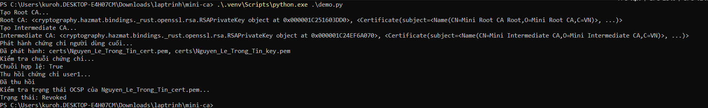
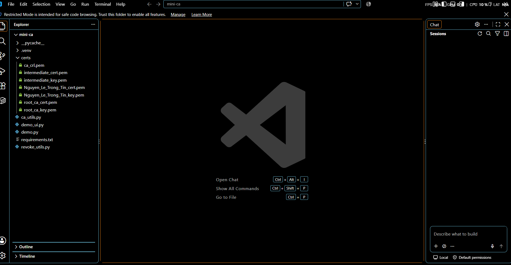
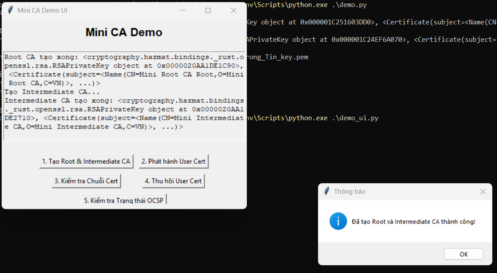
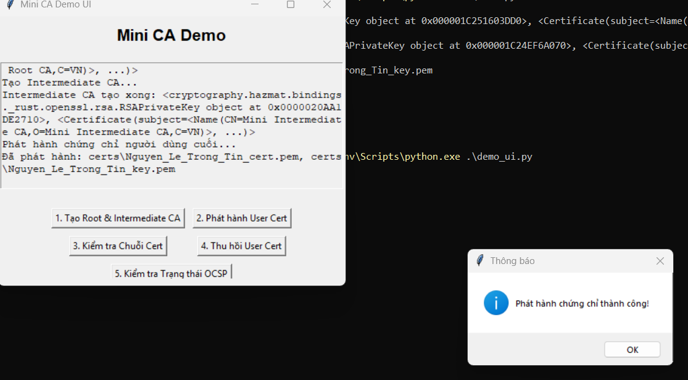
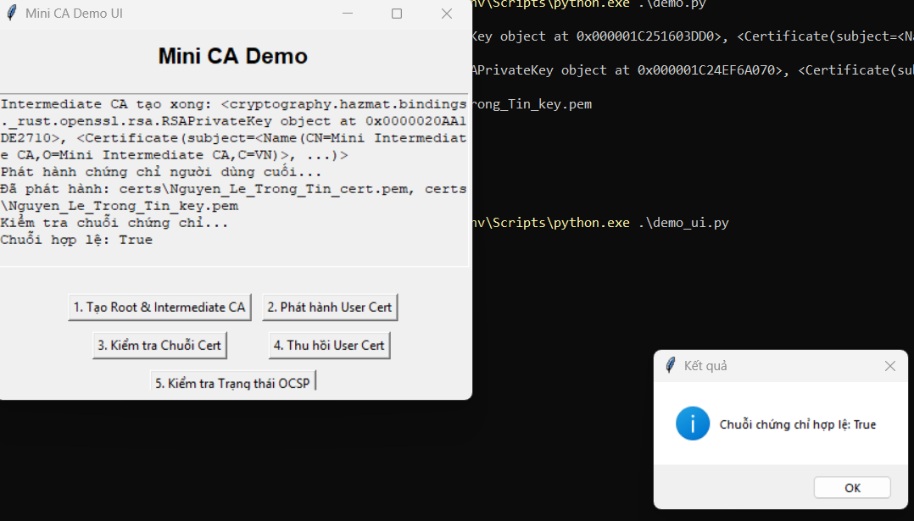
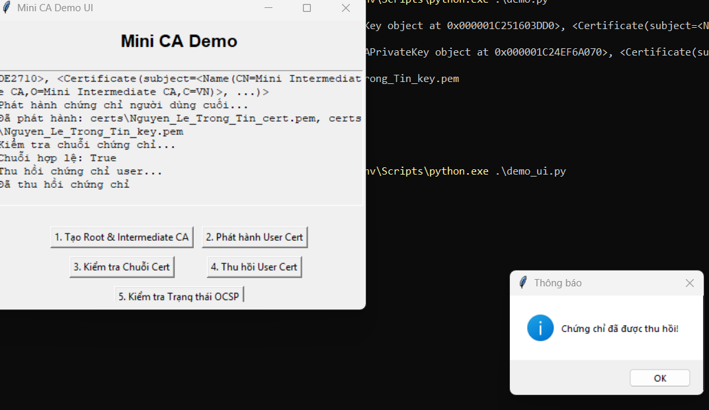
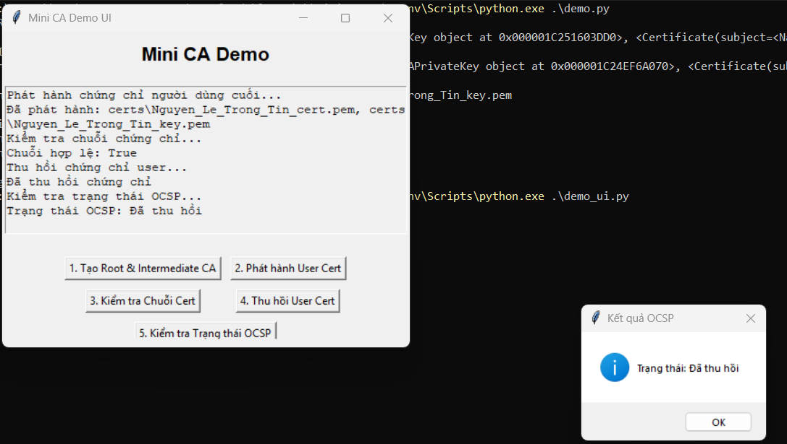

# Lab 2 — Mini Certificate Authority

> **Mục tiêu:** mô phỏng một hạ tầng khóa công khai (PKI) đơn giản gồm Root CA,
> Intermediate CA, chứng chỉ người dùng cuối, xác thực chuỗi chứng chỉ và thu hồi
> chứng chỉ bằng Certificate Revocation List (CRL).

## 1. Cấu trúc

```text
Lab2/
├── images/
├── ca_utils.py       # tạo khóa, CA, chứng chỉ và xác thực chuỗi
├── revoke_utils.py   # tạo/cập nhật CRL và kiểm tra trạng thái thu hồi
├── demo.py           # chạy toàn bộ quy trình trên terminal
├── demo_ui.py        # giao diện Tkinter thực hiện từng bước
└── requirements.txt
```

Thư mục `certs/` được tạo khi chạy chương trình và bị loại khỏi Git vì chứa khóa
riêng. Không đưa khóa `.pem` thật lên repository.

## 2. Cài đặt

```powershell
cd "Buoi 2\Lab2"
python -m venv .venv
.\.venv\Scripts\python.exe -m pip install -r requirements.txt
```

Lab sử dụng thư viện `cryptography` để tạo khóa RSA, chứng chỉ X.509, chữ ký và
CRL.

## 3. Kiến trúc chuỗi chứng chỉ

```text
Root CA (tự ký, hiệu lực 10 năm, path_length=1)
└── Intermediate CA (Root CA ký, hiệu lực 5 năm, path_length=0)
    └── Nguyen_Le_Trong_Tin (Intermediate CA ký, hiệu lực 1 năm, ca=False)
```

### Root CA

`create_root_ca()` sinh khóa RSA 2048 bit, tạo chứng chỉ tự ký và đặt
`BasicConstraints(ca=True, path_length=1)`. Khóa và chứng chỉ được lưu thành:

- `certs/root_ca_key.pem`
- `certs/root_ca_cert.pem`

### Intermediate CA

`create_intermediate_ca()` tạo một CA trung gian, lấy subject của Root CA làm
issuer và dùng khóa riêng Root CA để ký. `path_length=0` ngăn Intermediate CA cấp
thêm một tầng CA con.

### Chứng chỉ người dùng

`issue_certificate()` tạo khóa riêng mới và chứng chỉ X.509 có subject
`Nguyen_Le_Trong_Tin`. Chứng chỉ được ký bởi Intermediate CA và có
`BasicConstraints(ca=False)`.

## 4. Xác thực chuỗi

`verify_certificate_chain()` đi lần lượt từ chứng chỉ người dùng đến Intermediate
CA rồi Root CA. Ở mỗi tầng, public key của issuer xác minh chữ ký RSA/SHA-256 trên
`tbs_certificate_bytes`. Hàm trả `True` khi tất cả chữ ký trong chuỗi đều hợp lệ.

## 5. Thu hồi chứng chỉ và CRL

`revoke_certificate()`:

1. Đọc chứng chỉ cần thu hồi, chứng chỉ CA phát hành và khóa riêng của CA.
2. Nạp CRL hiện tại nếu đã tồn tại.
3. Thêm serial number của chứng chỉ cùng thời điểm và lý do thu hồi.
4. Tạo lại CRL có hiệu lực cập nhật 7 ngày, ký bằng khóa Intermediate CA và lưu
   thành `certs/ca_crl.pem`.

`check_revocation_status()` so serial number của chứng chỉ với các mục trong CRL.
Nút **Kiểm tra Trạng thái OCSP** trong giao diện mô phỏng việc kiểm tra trạng thái
bằng CRL cục bộ; đây không phải một OCSP server hoạt động qua mạng.

## 6. Chạy toàn bộ quy trình trên terminal

```powershell
.\.venv\Scripts\python.exe .\demo.py
```

Chương trình thực hiện tuần tự: tạo hai CA → cấp chứng chỉ người dùng → xác thực
chuỗi → thu hồi chứng chỉ → kiểm tra trạng thái. Kết quả quan trọng:

```text
Chuỗi hợp lệ: True
Trạng thái: Revoked
```



Các file sinh ra trong `certs/`:



## 7. Chạy giao diện Tkinter

```powershell
.\.venv\Scripts\python.exe .\demo_ui.py
```

Thực hiện đúng thứ tự năm nút:

### Bước 1 — Tạo Root CA và Intermediate CA



### Bước 2 — Phát hành chứng chỉ người dùng

Chương trình tạo `Nguyen_Le_Trong_Tin_key.pem` và
`Nguyen_Le_Trong_Tin_cert.pem`.



### Bước 3 — Kiểm tra chuỗi chứng chỉ

Kết quả mong đợi là `Chuỗi chứng chỉ hợp lệ: True`.



### Bước 4 — Thu hồi chứng chỉ

Serial number của chứng chỉ người dùng được thêm vào CRL đã ký.



### Bước 5 — Kiểm tra trạng thái

Kết quả mong đợi là `Trạng thái: Đã thu hồi`.



## 8. Lưu ý an toàn

- Khóa riêng CA là tài sản nhạy cảm; bài lab lưu khóa không mật khẩu chỉ để minh
  họa, không dùng mô hình này trong production.
- Không commit thư mục `certs/`, khóa `.pem` hoặc CRL chứa dữ liệu thật.
- Hàm xác thực trong lab tập trung vào chữ ký; một hệ thống PKI thực tế còn phải
  kiểm tra thời hạn, Key Usage, Extended Key Usage, hostname, policy và trust
  anchor.
