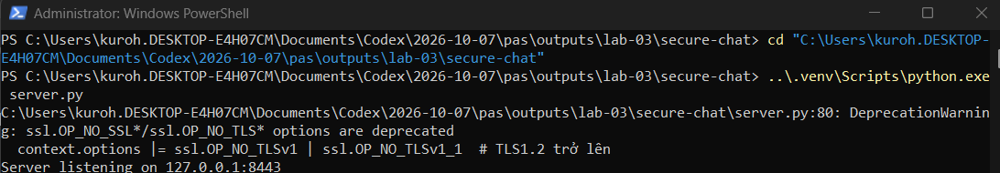
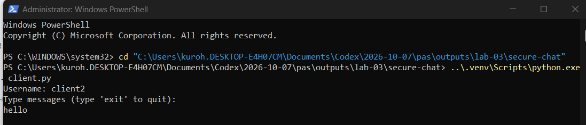
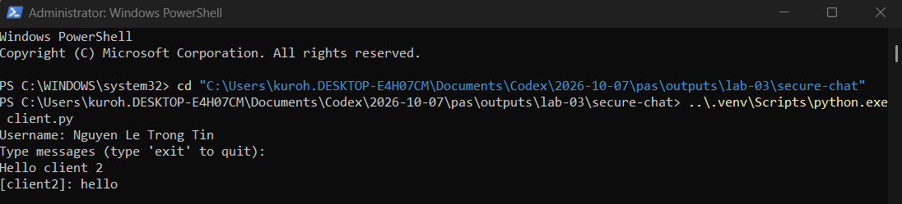
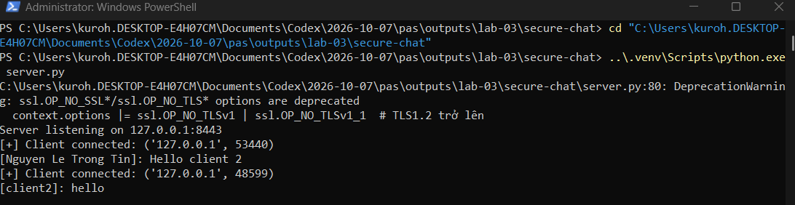
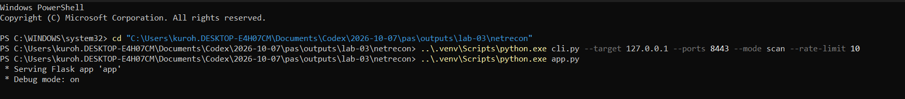
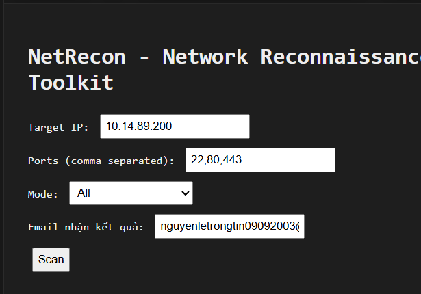
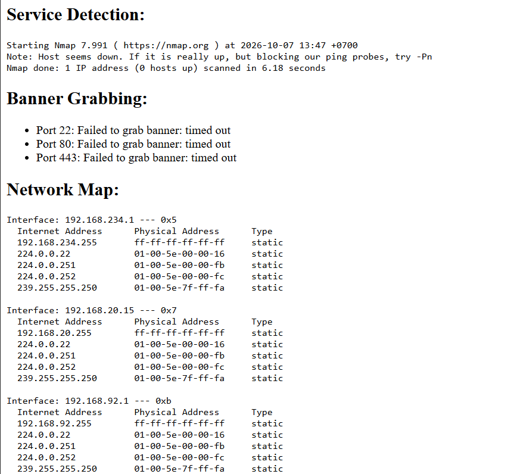
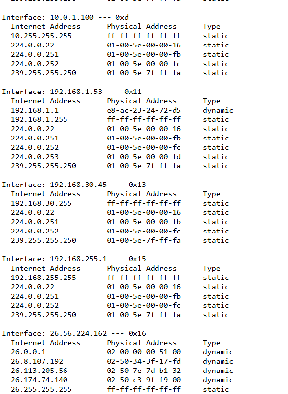
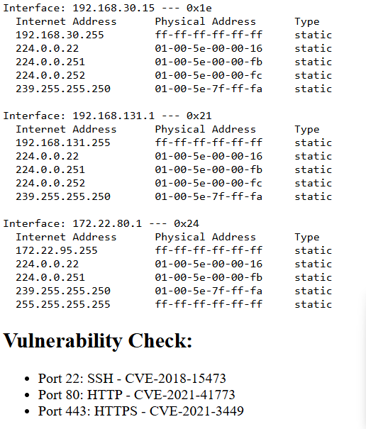
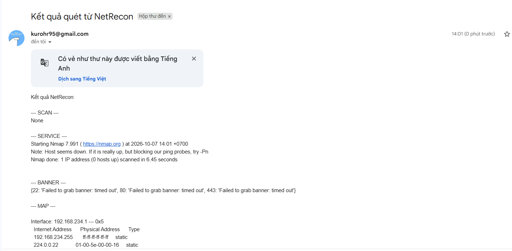

# Buổi 3 - Lab 03: SecureChat và NetRecon

- **Sinh viên:** Nguyen Le Trong Tin
- **MSSV:** 2387700068
- **Môn học:** Thực hành Lập trình An toàn Thông tin
- **Tài liệu thực hành:** `lab-03.pdf`

Bài gồm hai phần: ứng dụng chat qua TLS, mã hóa tin nhắn bằng AES; và công cụ
NetRecon có CLI, giao diện Flask, quét cổng, nhận dạng dịch vụ và gửi kết quả qua email.
Mã nguồn Python, HTML, CSS và nội dung lệnh tạo chứng chỉ giữ nguyên bản đã chép
từ tài liệu. File `.bat` dùng kết thúc dòng CRLF để chạy trên Windows.

## 1. Cấu trúc thư mục

```text
Buoi 3/
├── README.md
├── .gitignore
├── images/                       # ảnh thực hành
├── secure-chat/
│   ├── openssl.cnf
│   ├── make-certs.bat
│   ├── message_encryption.py
│   ├── connection_manager.py
│   ├── room_manager.py
│   ├── server.py
│   └── client.py
└── netrecon/
    ├── .env.example               # sao chép thành .env để cấu hình email
    ├── requirements.txt           # giữ danh sách gốc trong PDF
    ├── cli.py
    ├── app.py
    ├── modules/
    │   ├── __init__.py
    │   ├── port_scanner.py
    │   ├── service_detector.py
    │   ├── banner_grabber.py
    │   ├── network_mapper.py
    │   ├── vuln_checker.py
    │   ├── filter_utils.py
    │   └── email_sender.py
    ├── templates/
    │   ├── index.html
    │   ├── layout.html
    │   └── result.html
    └── static/
        └── style.css
```

`.venv/`, `.env`, log và `secure-chat/certs/` được tạo trên máy chạy bài,
không đưa lên repository. Bản tải về cần tạo môi trường, chứng chỉ và cấu hình
email theo hướng dẫn bên dưới.

## 2. Chuẩn bị môi trường trên Windows

Cần Python 3.12, OpenSSL và Nmap. Môi trường thực hành sử dụng Windows PowerShell,
Python 3.12.14 và Nmap 7.991.

Tải repository và chuyển vào thư mục bài:

```powershell
git clone https://github.com/Tindaptrai/2387700068_NguyenLeTrongTin.git
cd ".\2387700068_NguyenLeTrongTin\Buoi 3"
```

Nếu đã tải repository, chỉ cần mở PowerShell tại thư mục `Buoi 3`.
Chạy từng lệnh từ trên xuống, đợi lệnh trước hoàn tất rồi chạy lệnh tiếp theo.

```powershell
py -3.12 --version
openssl version
nmap --version
py -3.12 -m venv .venv
.\.venv\Scripts\python.exe -m pip install cryptography flask click python-dotenv
```

Các lệnh cài trên dùng thư viện thực sự được code import. `asyncio` có sẵn trong
Python. `netrecon/requirements.txt` được giữ nguyên từ PDF, trong đó còn có
`asyncio` và `htmx`; không cần cài hai gói PyPI này để chạy code đã cung cấp.
Không cần kích hoạt `Activate.ps1` vì các lệnh gọi trực tiếp Python trong `.venv`.

Nếu OpenSSL hoặc Nmap chưa có trong PATH, thêm đúng thư mục cài đặt. Trên máy
thực hành, OpenSSL có sẵn trong Git for Windows:

```powershell
$env:Path = 'C:\Program Files\Git\usr\bin;C:\Program Files (x86)\Nmap;' + $env:Path
openssl version
nmap --version
```

Lệnh PATH chỉ áp dụng cho cửa sổ PowerShell hiện tại; chạy lại trong mỗi cửa sổ
mới nếu cần. Nếu cài ở vị trí khác, thay đường dẫn tương ứng.

## 3. SecureChat

### 3.1. Thành phần và luồng xử lý

| File | Vai trò |
| --- | --- |
| `openssl.cnf` | Cấu hình Root CA cho OpenSSL. |
| `make-certs.bat` | Tạo CA, khóa và chứng chỉ server/client. |
| `message_encryption.py` | AES-256-CBC, IV ngẫu nhiên và padding PKCS7. |
| `connection_manager.py` | Lưu socket, username, khóa AES và quản lý kết nối. |
| `room_manager.py` | Quản lý phòng chat; server cho client vào phòng `general`. |
| `server.py` | Lắng nghe `127.0.0.1:8443`, xác thực chứng chỉ client, nhận và chuyển tin. |
| `client.py` | Kết nối TLS, gửi username/khóa AES và trao đổi tin nhắn. |

CA ký chứng chỉ server và client. Hai phía kiểm tra chuỗi chứng chỉ; client trong
code gốc đặt `check_hostname=False`. Mỗi client sinh khóa AES 32 byte rồi gửi
username và khóa qua kết nối TLS. Server giải mã tin nhận, thêm tên người gửi,
sau đó mã hóa lại theo khóa của từng client khác trước khi chuyển tin.

### 3.2. Tạo chứng chỉ

Từ thư mục `Buoi 3`, chạy:

```powershell
cd .\secure-chat
.\make-certs.bat
```

Nhấn một phím khi chương trình hiện `Press any key...`. Các file cần có:

```text
certs/ca/ca.crt
certs/ca/ca.key
certs/server/server.crt
certs/server/server.key
certs/client/client.crt
certs/client/client.key
```

Có thể kiểm tra chuỗi chứng chỉ:

```powershell
openssl verify -CAfile .\certs\ca\ca.crt .\certs\server\server.crt
openssl verify -CAfile .\certs\ca\ca.crt .\certs\client\client.crt
```

Kết quả mong đợi là `OK` cho cả hai chứng chỉ. Không cần chạy riêng `openssl.cnf`.

### 3.3. Terminal 1: chạy server

Đứng trong `Buoi 3\secure-chat`:

```powershell
..\.venv\Scripts\python.exe .\server.py
```

Giữ terminal này hoạt động. Server thông báo:

```text
Server listening on 127.0.0.1:8443
```



### 3.4. Terminal 2 và 3: chạy hai client

Mở hai PowerShell mới, chuyển từng cửa sổ vào `Buoi 3\secure-chat` rồi chạy:

```powershell
..\.venv\Scripts\python.exe .\client.py
```

Nhập username `Nguyen Le Trong Tin` ở client thứ nhất và `client2` ở client thứ hai.
Chờ cả hai kết nối xong, gõ tin nhắn rồi nhấn Enter. Client còn lại nhận tin;
server không gửi lại tin cho người gửi. Nhập `exit` để thoát client; dùng `Ctrl+C`
để dừng server.







Các ảnh cho thấy hai client kết nối và Tin nhận được `[client2]: hello`.
Ảnh client2 hiện tại ghi tin đã nhập; chưa thể hiện client2 nhận tin từ Tin.

## 4. NetRecon qua CLI

Các lệnh ở phần này chạy trong `Buoi 3\netrecon`. Nếu đang ở `secure-chat`, dùng:

```powershell
cd ..\netrecon
..\.venv\Scripts\python.exe .\cli.py --help
```

| Mode | Chức năng trong code |
| --- | --- |
| `scan` | Kết nối TCP bất đồng bộ, in các cổng mở và ghi log. |
| `service` | Gọi `nmap -sV -p ...` để nhận dạng dịch vụ. |
| `banner` | Kết nối socket và chờ banner tối đa 2 giây. |
| `map` | Đọc bảng ARP cục bộ bằng `arp -a`. |
| `vuln` | Tra danh sách CVE mẫu theo số cổng. |
| `all` | Chạy lần lượt năm chức năng trên. |

Dùng chính máy thực hành làm mục tiêu. Giữ SecureChat server chạy để cổng 8443
mở; giữ Flask chạy theo phần 5 để cổng 5000 mở. Chạy từng lệnh riêng:

```powershell
..\.venv\Scripts\python.exe .\cli.py --target 127.0.0.1 --ports 8443,5000 --mode scan --rate-limit 10
..\.venv\Scripts\python.exe .\cli.py --target 127.0.0.1 --ports 5000 --mode service
..\.venv\Scripts\python.exe .\cli.py --target 127.0.0.1 --ports 5000 --mode banner
..\.venv\Scripts\python.exe .\cli.py --target 127.0.0.1 --mode map
..\.venv\Scripts\python.exe .\cli.py --target 127.0.0.1 --ports 21,22,23,80,443 --mode vuln
..\.venv\Scripts\python.exe .\cli.py --target 127.0.0.1 --ports 8443,5000 --mode all --rate-limit 10
```

`--rate-limit` trong code là số tác vụ scan có thể kết nối đồng thời. Cổng đóng
không được in ra ở mode `scan`. Danh sách cổng phải phân tách bằng dấu phẩy;
code chưa hỗ trợ cú pháp khoảng cổng mặc dù help có nhắc `range`.
CLI không gửi email.



Ảnh trên ghi lại các lệnh khởi động, chưa có dòng kết quả cổng mở.

## 5. NetRecon qua web và email

### 5.1. Cấu hình tài khoản gửi

Trong `Buoi 3\netrecon`, sao chép file mẫu:

```powershell
Copy-Item .\.env.example .\.env
```

Mở `.env`, điền Gmail dùng gửi thư và mật khẩu ứng dụng của chính tài khoản đó:

```dotenv
SMTP_USER=your_gmail@gmail.com
SMTP_PASS=your_16_character_app_password
```

Hai giá trị trên chỉ là chỗ giữ chỗ; cần thay bằng thông tin thật trên máy của bạn.
Gmail cần bật Xác minh 2 bước để tạo mật khẩu ứng dụng. Không dùng mật khẩu đăng
nhập Gmail và không commit `.env`. Nếu đã có `.env`, chỉnh file đang dùng thay vì
sao chép đè. Sau khi đổi cấu hình, dừng/chạy lại Flask để nạp giá trị mới.

### 5.2. Chạy giao diện

Trong `Buoi 3\netrecon`:

```powershell
..\.venv\Scripts\python.exe .\app.py
```

Mở <http://127.0.0.1:5000/> và nhập:

- **Target IP:** `127.0.0.1`.
- **Ports:** `5000`, hoặc `8443,5000` nếu SecureChat server đang chạy.
- **Mode:** `All`.
- **Email nhận kết quả:** địa chỉ bạn muốn nhận thư.

Bấm **Scan**, đợi các bước hoàn tất rồi xem trang kết quả và hộp thư.
`SMTP_USER` là người gửi; ô email trên form là người nhận.



Ảnh form đã chụp dùng IP mẫu `10.14.89.200`, các cổng `22,80,443`.
IP này chưa được xác nhận hoạt động trong mạng thực hành hiện tại.

### 5.3. Kết quả đã ghi nhận







Trong lần chạy được chụp, Nmap báo `Host seems down` và `0 hosts up`;
Banner Grabbing báo timeout. Các ảnh xác nhận trang kết quả đã hiển thị các phần,
chưa xác nhận mục tiêu đó đang hoạt động hay nhận dạng được phiên bản dịch vụ.
Để kiểm tra với một dịch vụ đang chạy, dùng `127.0.0.1:5000` như phần 5.2.

### 5.4. Email đã nhận



Ảnh xác nhận hộp thư đã nhận thư có tiêu đề **Kết quả quét từ NetRecon**, kèm nội
dung các mục `SCAN`, `SERVICE`, `BANNER`, `MAP`. Dữ liệu `SERVICE` trong thư là
kết quả `Host seems down` của lần quét đó; gửi thư thành công không đồng nghĩa
mục tiêu quét đang hoạt động.

Trong PowerShell, `[+] Email sent to ...` cho biết SMTP đã gửi. Nếu hiện
`[-] Email failed: ...`, xem chi tiết lỗi xác thực/kết nối. Code bắt lỗi gửi thư
và vẫn trả trang kết quả, nên trang web hiện kết quả chưa đủ xác nhận gửi thành công.

## 6. Các module hỗ trợ và file giao diện

- `message_encryption.py`, `connection_manager.py`, `room_manager.py` được
  server/client import; không cần khởi chạy riêng.
- Các file trong `netrecon/modules/` được `cli.py` hoặc `app.py` gọi theo mode.
- `filter_utils.py` có hàm whitelist/blacklist, nhưng code chính chưa gọi hàm này.
- `modules/__init__.py` là file trống đánh dấu package.
- Flask đọc HTML trong `templates/` và CSS trong `static/`; không chạy riêng bằng Python.
- `.env` được `python-dotenv` đọc; `requirements.txt` dùng cho cài thư viện.

## 7. Lỗi thường gặp và giới hạn của bản code

| Hiện tượng | Giải thích / cách xử lý |
| --- | --- |
| `WinError 2` trong Service Detection | Không tìm được Nmap. Kiểm tra `nmap --version`, PATH và khởi động lại Flask. |
| Không tìm thấy `certs/...` | Chạy từ `secure-chat` và tạo chứng chỉ trước khi chạy server/client. |
| `WinError 10061` khi chạy client | Server chưa chạy hoặc không lắng nghe `127.0.0.1:8443`. |
| `WinError 10048` / cổng đã được dùng | Dừng bản server/Flask đã chạy trước đó rồi thử lại. |
| Thiếu `cryptography`, `flask`, `click`, `dotenv` | Cài thư viện bằng đúng Python của `.venv` ở phần 2. |
| `SCAN` là `None` hoặc web không hiện Scan Result | Hàm quét gốc chỉ in ra terminal, không trả dữ liệu; xem các dòng `[+] .../tcp open` ở PowerShell. |
| Banner timeout | Module chỉ chờ dữ liệu, không gửi HTTP request; timeout không đủ chứng minh cổng đóng. |
| `Host seems down` | Nmap không xác nhận được host hoạt động. Dùng IP đúng của máy/dịch vụ đang chạy, ví dụ localhost. |
| `Email failed` | Kiểm tra Gmail gửi, mật khẩu ứng dụng, mạng và chạy lại Flask sau khi sửa `.env`. |
| Cảnh báo tùy chọn TLS bị deprecated | Cảnh báo từ cách thiết lập TLS trong code gốc; ảnh server vẫn lắng nghe thành công. |

`Network Map` hiển thị ARP cache của máy, không thực hiện khám phá toàn bộ mạng.
`Vulnerability Check` chỉ ánh xạ số cổng sang CVE có sẵn; không phải kết luận mục
tiêu có lỗ hổng. Bản SecureChat chưa có cơ chế đóng khung dữ liệu socket riêng,
nên các khối dữ liệu bị gộp/chia khi truyền có thể gây lỗi giải mã.

## 8. Tài liệu tham khảo

- Tài liệu bài thực hành: `lab-03.pdf`.
- [Python venv](https://docs.python.org/3/library/venv.html).
- [Thư viện cryptography](https://cryptography.io/en/latest/).
- [OpenSSL](https://docs.openssl.org/).
- [Cài Nmap trên Windows](https://nmap.org/book/inst-windows.html).
- [Nmap service/version detection](https://nmap.org/book/man-version-detection.html).
- [Google: đăng nhập bằng mật khẩu ứng dụng](https://support.google.com/mail/answer/185833?hl=vi).
